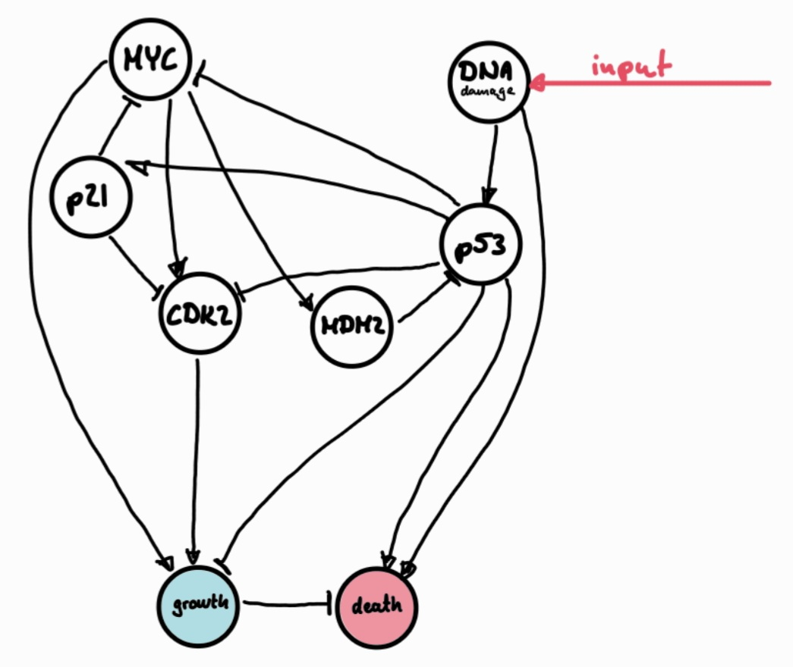

# Assignment 3 - Network biology
**Course:** Multi-scale Modeling of Biological Systems
**Assignment group 6**

## Team Members

- Andrea Fraschetti (Student ID: i6342072)
- Angelo Thompson (Student ID: i6325951)
- Balázs Ács (Student ID: i6316911)
- Lili Bodnár (Student ID: i6354888)

## How to run
1. Launch Jupyter notebook
2. Open Assignment 3 - KEN3170_BooleanModeling.ipynb
3. Make sure all the required libraries are installed.
3. Run all cells from top to bottom.

## Exercises

1. Which mutation is most dangerous and why? Provide quantitative evidence.
    Mutation A, B and C are equally dangerous as they all preclude the cell from any aptosis response (cell death) in the event of damaged DNA. For extensive evidence please look at graphs 2-11 in our notebook, but to summarize what we can see are the followings:

| Mutation                 | % of initial states ending in cancer-like attractor states|
| ------------------------ | --------------------------------------------------------- |
| No mutation              | 3.125% (8/256)                                            |
| A: p53 KO                | 50% (128/256)                                             |
| B: MYC amplification     | 50% (128/256)                                             |
| C: MDM2 overexpression   | 50% (128/256)                                             |
| D: p21 KO (custom)       | 3.125% (8/256)                                            |

    That is when the cell keeps growing despite the DNA damage, likely resulting in cancer. From the given scenerios A, B and C are highly likely to result in a cancer-like attractor with 50% probability each. 
        - Mutation A : removes the p53 that detects DNA damage --> no trigger for cell death or repair 
        - Mutation B : amplification of MYC gene leads to uncontrolled cell-growth
        - Mutation C : MDM2 overexpression supresses p53, the same tumor-suppressor disrupted in Mutation A

    In all three cases, the cell can no longer stop dividing (even when damage is detected).
    On the other hand, only 8% of no-mutation / mutation D scenerios end in cancer-like attractor states, making them less dangerous.

2. Explain the role of feedback loops (e.g., MYC → MDM2 → p53)

Feedback loops form a critical regulatory system that detects imbalaces and adjust cell growth and death accordingly. In the example of MYC → MDM2 → p53 :
    - MYC → MDM2 : The oncogene MYC promotes cell growth and proliferation. When MYC levels rise, it activates the expression of MDM2, an inhibitor of p53. When MYC is overexpressed (Mutation B), it increases MDM2, which in turn shuts off p53.
    - MDM2 ⟞ p53 : MDM2 inhibits p53 expression, preventing the cell from initiating cell-cycle arrest or apoptosis (Mutation C).
    - p53 ⟞ MYC / +p21 : In case of DNA damage, p53 is normally activated and inhibits MYC (either directly or via p21). This negative feedback slows down the cell cycle or triggers apoptosis to prevent damaged cells from dividing. Without this gene (Mutation A), the cell-growth will be unsupervised, and will continue even with DNA damage leading to cancerous cells.

Overall this feedback system is crucial for the cell's regulation, and an interuption to it at any point can be detrimental for the cell.
    
3. What are the limitations of this Boolean network model? Discuss 3 specific limitations.
    * Binary States:
        - One key limitation of this Boolean network is that it only allows each component to be either fully ON or fully OFF. In reality, molecules such as p53 or MYC can exist at different concentration levels, and their effects often depend on thresholds or gradual changes. By reducing these dynamics to binary states, the model cannot capture dose-dependent regulation or partial inhibition that occurs in real cells.
    * Lack of Temporal Dynamics:
        - Another limitation is that the network assumes all nodes update synchronously at each step. Biological processes, however, operate on very different timescales—phosphorylation happens quickly, while gene transcription and protein accumulation can take much longer. This simplification means the model cannot reflect transient dynamics, time delays, or oscillatory behaviors.
    * Simplified and Incomplete Topology:
        - Finally, the network structure is highly simplified and incomplete. Only a small set of genes and interactions are represented, while many other regulators of cell fate are excluded. Because the rules are manually specified, the model’s predictions strongly depend on these assumptions, and important pathways or feedback loops may be missing.