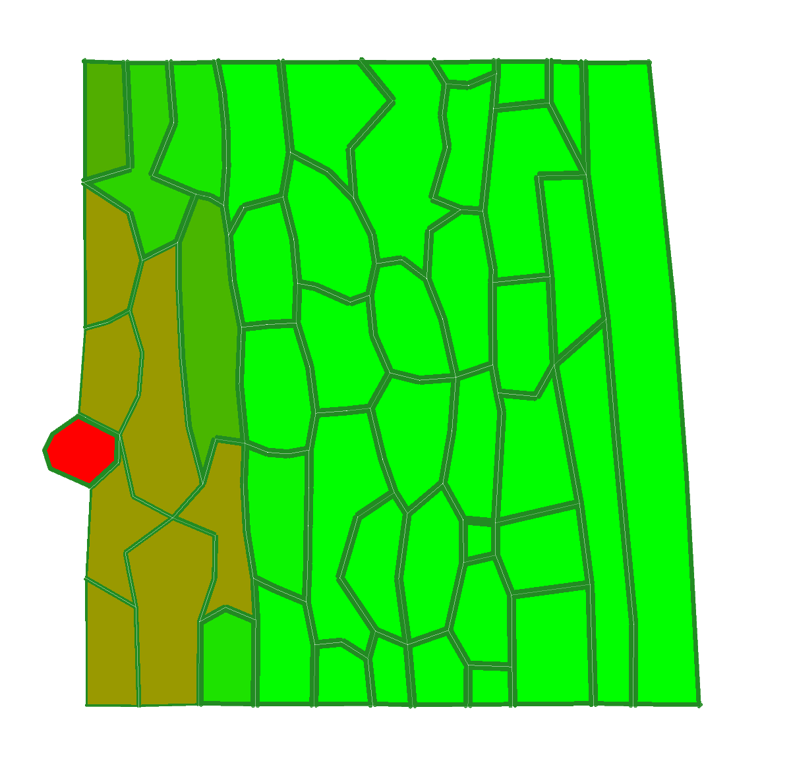
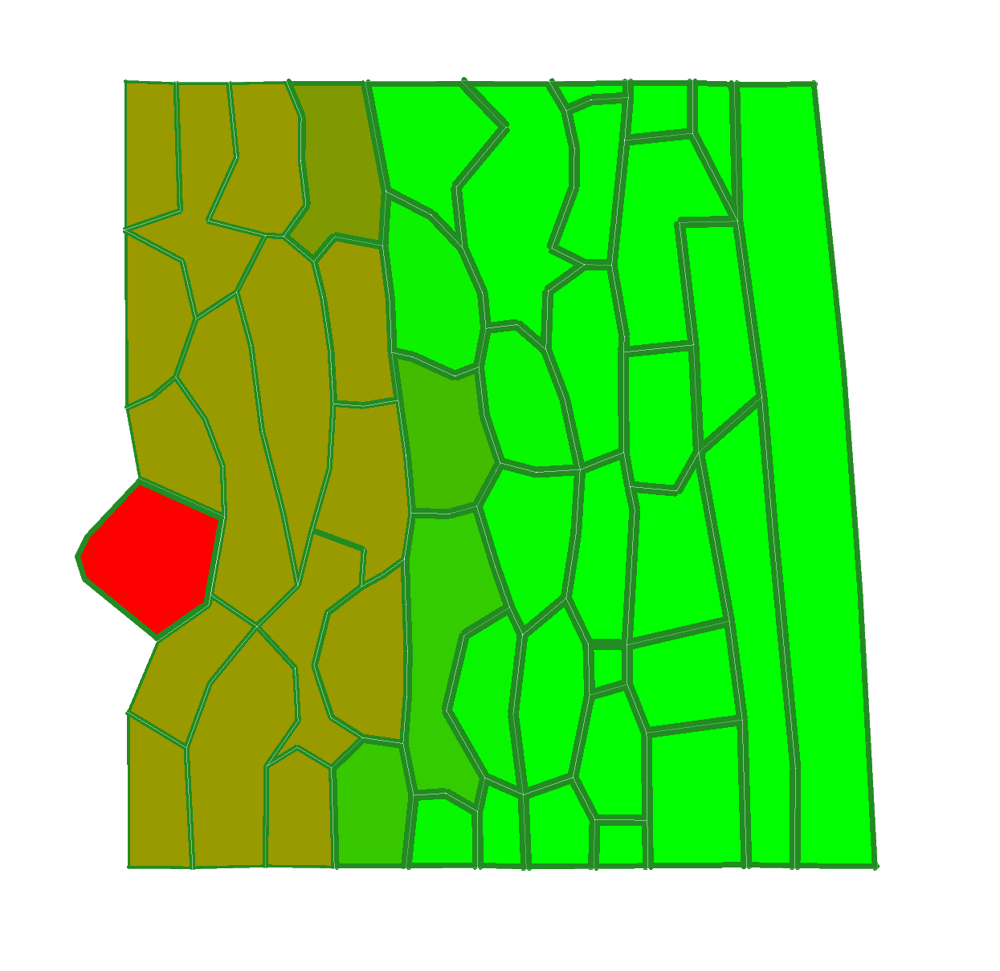

# Assignment 3 - Network biology
**Course:** Multi-scale Modeling of Biological Systems
**Assignment group 6**

## Team Members

- Andrea Fraschetti (Student ID: i6342072)
- Angelo Thompson (Student ID: i6325951)
- Balázs Ács (Student ID: i6316911)
- Lili Bodnár (Student ID: i6354888)

## Assignment Overview
This assignment focuses on modeling pathogen infection in plant tissues using a VirtualLeaf model. We investigate how a pathogen (red) infects plant tissue (green) by secreting a cell wall weakening chemical that reduces cell wall stability and facilitates further infection.


---

## Exercise 1: Model Simulation and Observations

### Simulation setup
- **Model**: Pathogen infection model in VirtualLeaf
- **Duration**: 4 hours simulation time
- **Documentation interval**: Every hour + initial state

#### Initial State (t = 0h)


**Description**: The tissue is fully healthy (bright green) in the beginning, and there is a red pathogen cell on the left side of the plant. Surrounding the pathogen, a narrow brown zone appears that shows the diffusion of the cell-wall-weakening chemical into neighboring plant cells. This chemical locally reduces cell wall stability, making the tissue more susceptible to infection. At t=0 no plant cells are infected yet.

#### 1 Hour (t = 1h)


**Description**: The infection starts spreading to the neighbouring cells, originated from the cell wall weakening (where the pathogen cell is connected to the plant). The infected cells become a shade of brown, and depending on how much the plant cell is infected it can be darker brown (closer to the origin) or a lighter shade (inwards, further away from the pathogen cell).
#### 2 Hours (t = 2h)


**Description**: At the two hour mark the whole left side of the plant is infected.

#### 3 Hours (t = 3h)


**Description**: The disease spreads further inwards, but in a slower rate now compared to the first hour.

#### 4 Hours (t = 4h)


**Description**: The spreading slows down, but seems to stop spreading any further. At this time stamp the first 4 layers of plant-cells are infected on the left side of the plant, however the infection haven't reached the center or the right side yet.

### Key Observations
The pathogen secretes a chemical that weakens the cell walls of the neighbouring plant cells. With the current diffusion and spreading coefficients, the infection doesn't spread throughout the whole plant, but stops after the first few layers.
This behaviour shows how the diffusion rate, decay, and infection threshold balance determine whether how far a pathogen can invade into plant tissue.

---

## Exercise 2: CellHouseKeeping Code Analysis

### Code Section Overview
- **Cell behaviour**: The function updates all the cells in the model once per time step. First if it is a pathogen cell, then we increase the cell's target area by two unit per iteration. This sets ideal size for the cell aka telling the cell to grow, hence initializing the spread rate for the infection.
- **Base wall length initialization**: Then we iterate through all the wall elements of the cel, initializing the NaN values with a deafult value of 25 for future calculations.
- **Pathogen level detection**: This is the part where we update the pathogen levels in the cell, we essentially double the pathogen-chemical-concentartion, however we cap it at 1.2. This is so we keep the simulation realistic.
- **Cell wall weakening**: If the cell is infeced (aka the pathogen-chem-level is above 0.1) then to mimic the disease behaviour, we decrease the wall-stiffness proportionally to the chem-level. At healthy cells that are not infected yet (or if the current cell is the pathogen cell) the wall-stiffness-value remains untouched.


### Biological Relevance
This function represents how the plant hendles infection spread. It updates each cell’s internal and wall properties at every simulation step, and makes cell walls more penetrable in areas where the pathogen’s chemical accumulates.

---

## Exercise 3: Cell to cell transport analysis

### Completed network


### Missing elements:
1. **Decreasing wall stability**: When the chemical diffusion reaches a new cell, it decreases the cell's wall-stiffness, making it more susceptible.
2. **Increasing pathogen concentration**: If a cell becomes infected, it starts producin pathongen and the concentration is doubled in the cell at each iteration, reinforcing the the cycle.
3. **Capping pathongen concentration**: What the model does not show is that the concentration level can reach a maximum of 1.2, and capped at that point to keep the diffusion simulation realistic.
4. **Feedback loop**: The model also does not include a the additiononl logic from the code that checks whether the cell is already infected or not. In case the cell is healthy (C(0)=0) the wall stability remains the same.

---

## Exercise 4: Diffusion Coefficient Analysis

### Experimental Setup
- **Original diffusion coefficient**: 10^-5
- **Decreased coefficient**: 10^-6
- **Increased coefficient**: 10^-4

### Results

#### Decreased diffusion coefficient by factor of 10 (10^-6)
#### Initial State (t = 0h)


**Description**: TODO

#### 1 Hour (t = 1h)


**Description**: TODO

#### 2 Hours (t = 2h)


**Description**:TODO

#### 3 Hours (t = 3h)


**Description**: TODO

#### 4 Hours (t = 4h)


**Description**: TODO

----
#### Increased diffusion coefficient by factor of 10 (10^-4)
#### Initial State (t = 0h)


**Description**: TODO

#### 1 Hour (t = 1h)


**Description**: TODO

#### 2 Hours (t = 2h)


**Description**: TODO

#### 3 Hours (t = 3h)


**Description**: TODO

#### 4 Hours (t = 4h)


**Description**: TODO

### Key Observations
TODO: summarize how changing the diffusion coeff changes the infection pattern, speed, etc.

---

## Exercise 5: Plant Defense Mechanism Implementation

Implement a defense mechanism for the cell, where it detects the chemical and triggers a signal for uninfected plant cells to strengthen their cell wall.

### Pseudocode

```pseudocode

```


---

## File Structure
```
Assignment_4/
├── README.md                           # This documentation
├── exercise1/                        # Simulation screenshots
│   ├── initial_state.png
│   ├── 1hour.png
│   ├── 2hours.png
│   ├── 3hours.png
│   └── 4hours.png
├── exercise4/                        # Simulation screenshots
│   ├── diff_decrease_t0.png
│   ├── diff_decrease_t1.png
│   ├── diff_decrease_t2.png
│   ├── diff_decrease_t3.png
│   ├── diff_decrease_t4.png
│   ├── diff_increase_t0.png
│   ├── diff_increase_t1.png
│   ├── diff_increase_t2.png
│   ├── diff_increase_t3.png
│   └── diff_increase_t4.png
└── network_completed.png              # Exercise3
```
